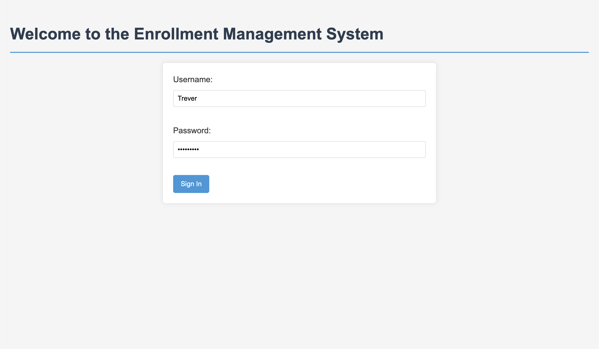
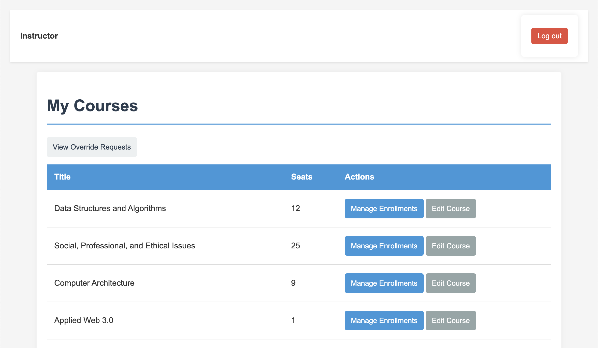
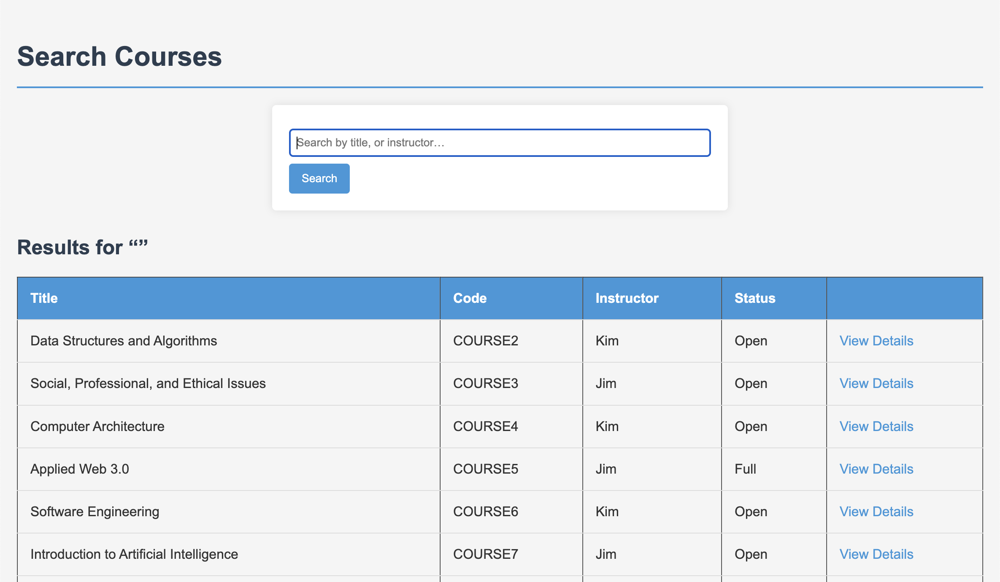
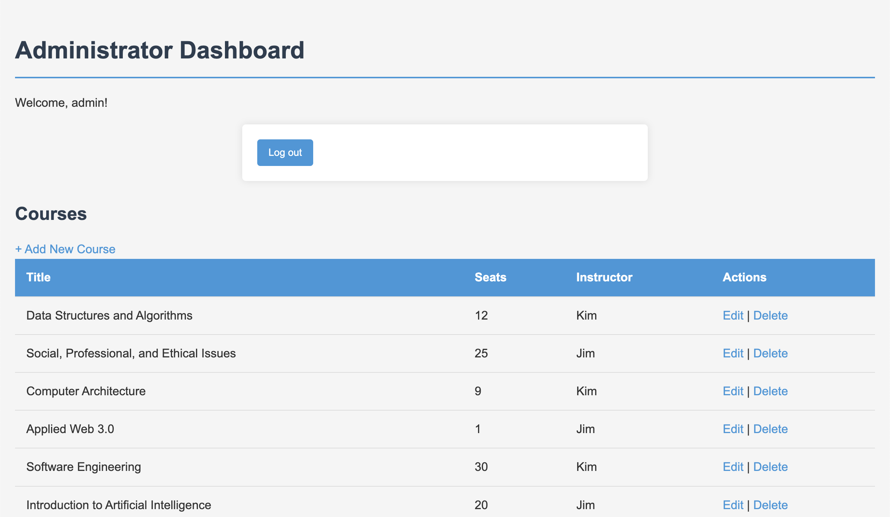

# University Course Manager

A full-featured Django web application for managing university course enrollment. Built by a team of five using Agile Scrum methodology and test-driven development, the system streamlines scheduling, instructor approvals, and course access with clean, role-based dashboards.

---

## 🚀 Features

- **Role-Based Dashboards**
  - Student: Browse, enroll, drop, and request overrides
  - Instructor: Manage student enrollments and approve requests
  - Administrator: Create/edit courses, manage users, set prerequisites
  - Advisor: (Bonus) View and guide student plans

- **Authentication System**
  - Secure login using Django’s built-in auth
  - Dashboard access restricted by user group

- **Waitlist and Override Requests**
  - Students can request enrollment in full or restricted courses
  - Instructors/Admins can approve/deny requests with a click

- **Modular Design**
  - Each role built as a separate Django app for clarity and maintainability

- **Minimalist UI**
  - Consistent CSS theme for a unified, easy-to-use interface

---

## 🛠 Tech Stack

- **Backend:** Django (Python)
- **Frontend:** HTML, CSS
- **Testing:** Django’s built-in test framework (`manage.py test`)
- **Development Methodology:** Agile (Scrum), Trello, 2 Sprints, Test-Driven Development (TDD)

---

## 🎓 Project Overview

This system was created for a university software engineering course to address common issues in course enrollment processes — such as multi-platform inefficiencies, instructor delays, and lack of real-time data. The resulting product improves administrative control, streamlines student access, and enhances communication across all user types.

---

## 🧪 How to Run Locally

    # Clone the repository
    git clone https://github.com/yourusername/university-course-manager.git
    cd university-course-manager

    # Create a virtual environment
    python3 -m venv venv
    source venv/bin/activate  # or .\venv\Scripts\activate on Windows

    # Install dependencies
    pip install -r requirements.txt

    # Apply migrations
    python manage.py migrate

    # Run the development server
    python manage.py runserver

> You can create test accounts via the Django admin panel or load any included fixtures.

---

## 📸 Screenshots
*Doesn't show all available features*

### Login Page

### Instructor Dashboard

### Enrollment Request Flow

### Admin Panel

---

## 👤 Author Role

This project was built collaboratively, with each member contributing to specific application modules.  
**My contributions included:**
- Building the complete **Instructor** interface and its CSS  
- Contributing to the **Administrator** module  
- Writing unit tests for the above modules  
- Leading consistency and flow for instructor-side UX  
- Collaborating using Scrum methodology across two structured sprints

---

## 📄 License

This project is for academic demonstration purposes and is not currently licensed for commercial use.
